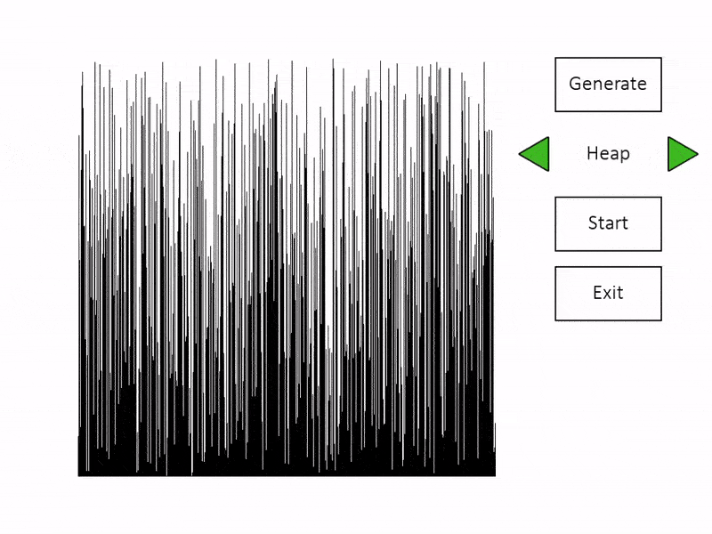
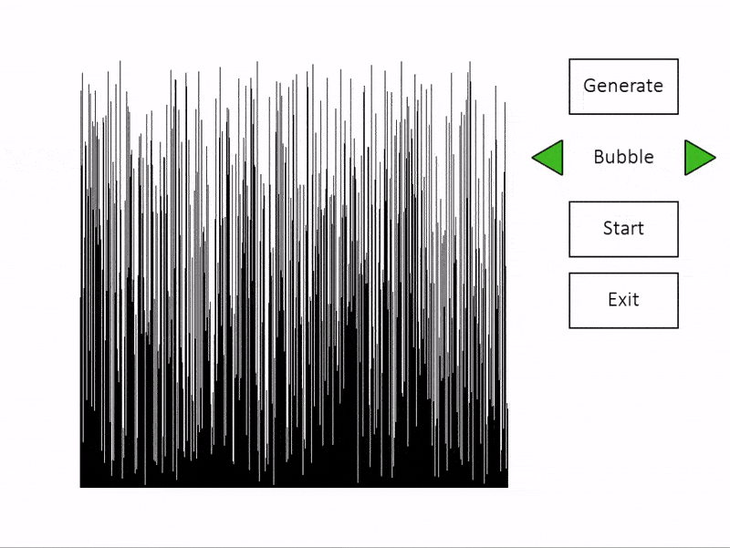

# sorting-visualizer
A program to visualize the sorting algorithms step-by-step. 

## External libraries
Built on pygame. Python 3.8.3.

## Sorting algorithms
The program includes:
- bubble sort
- insertion sort
- merge sort
- selection sort
- quick sort
- heap sort
- counting sort
- radix sort
- Shell sort

